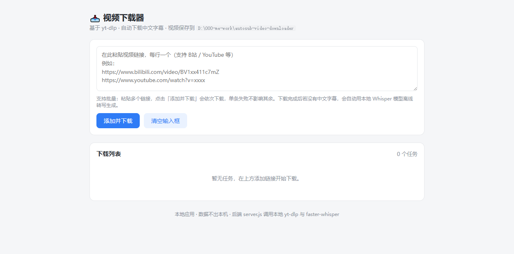

# Autosub Video Downloader · 自动字幕视频下载器

基于 [yt-dlp](https://github.com/yt-dlp/yt-dlp) + [faster-whisper](https://github.com/SYSTRAN/faster-whisper) 的本地视频下载器，带网页界面。

**一句话：贴个链接，下载最高清晰度视频 → 自动检测有没有中文字幕 → 没有就用本地 Whisper 大模型把语音离线转写成简体中文字幕。全程不用动手，数据不出本机。**

A local video downloader with a web UI. Paste links → downloads best quality via yt-dlp → automatically generates Simplified-Chinese subtitles with a local Whisper model when none exist. 100% offline transcription, nothing leaves your machine.

## ✨ 特性

- 🖥 **网页界面**：粘贴链接（支持批量，B 站 / YouTube 等 yt-dlp 支持的站点）→ 点下载 → 实时进度条（百分比 / 速度 / 剩余时间），不用记命令
- 📁 **自动归档**：每条视频自动建同名文件夹，视频 + 字幕集中存放
- 🈶 **自动中文字幕（核心特色）**：
  - 下载时优先抓取站点自带的简体中文字幕（含自动字幕）
  - 下载完成后检测，若没有中文字幕 → 自动调用本地 Whisper（faster-whisper large-v3）把音频离线转写成带时间戳的 SRT，**无需任何手动操作**
  - 离线转写完全在本机运行，不上传任何数据；有 NVIDIA 显卡自动用 GPU 加速
- ▶ **完成即看**：界面上直接「播放」「打开文件夹」「查看字幕」
- 🔁 **状态不丢**：任务记录落盘，服务重启后已完成任务仍可打开
- 🪟 **纯本地**：单文件 Node 服务 + 单文件前端，无任何依赖包、无遥测

## 📸 界面预览



## 🚀 快速开始（Windows）

### 第 1 步：准备三样东西

1. **[Node.js](https://nodejs.org)**（任意近期版本，装完 `node -v` 能出版本即可）
2. **yt-dlp**：从 [官方 Releases](https://github.com/yt-dlp/yt-dlp/releases) 下载 `yt-dlp.exe`，放到本项目目录
   > ⚠ 请下载完整的 `yt-dlp.exe`（约 17MB+）。如果只有 100KB 左右，那是 pip 安装产生的启动器桩，离开原机器无法运行
3. **ffmpeg**：从 [ffmpeg 官网](https://ffmpeg.org/download.html) 或 [gyan.dev](https://www.gyan.dev/ffmpeg/builds/) 下载，解压后把 `bin` 目录放到 `ffmpeg\bin\`（即项目内存在 `ffmpeg\bin\ffmpeg.exe`）；或者装到系统 PATH 里也行

### 第 2 步：配置（可选但推荐）

复制 `config.example.json` 为 `config.json`，按需修改：

```json
{
  "port": 8731,
  "proxy": "http://127.0.0.1:7897",
  "downloadDir": "",
  "python": "C:/path/to/your/python.exe",
  "whisperModel": "",
  "language": "zh",
  "cookiesFromBrowser": ""
}
```

| 配置项 | 说明 |
|---|---|
| `port` | 网页界面端口，默认 8731 |
| `proxy` | HTTP 代理。**访问 YouTube 必须走代理**（如 Clash 的 `http://127.0.0.1:7897`）；只下 B 站可留空 |
| `downloadDir` | 视频保存目录，留空 = 项目目录本身 |
| `python` | **自动字幕功能必填**：指向装了 faster-whisper 的 Python 解释器 |
| `whisperModel` | 本地 Whisper 模型目录；留空 = 首次转写时自动下载 large-v3（约 3GB）到用户缓存 |
| `language` | 转写语言，默认 `zh`（简体中文） |
| `cookiesFromBrowser` | 留空则优先用项目目录的 `cookies.txt`；也可填 `"chrome"` / `"edge"` 直接读浏览器 |

### 第 3 步（可选）：启用自动字幕的 Python 环境

```bash
# 任意 Python 3.8+ 环境
pip install faster-whisper zhconv
```

然后把该环境的 python.exe 路径填进 `config.json` 的 `python` 字段。
没配也不影响下载功能，只是不会自动转写字幕（界面仍保留手动「🎙 生成字幕」按钮，点击时会提示配置错误）。

> **GPU 加速（NVIDIA）**：Windows 上脚本会自动从本机 Ollama 或 CUDA Toolkit 目录补齐 cublas DLL，无需手动装 CUDA。无 N 卡则自动用 CPU（较慢但可用）。

### 第 4 步（可选）：站点 Cookie（获取站点字幕 / 解锁 YouTube）

**B 站和 YouTube 的 Cookie 是各自独立的文件，互不干扰：**

| 站点 | Cookie 文件 | 作用 |
|---|---|---|
| B 站 | `cookies-bilibili.txt` | 获取 UP 主上传的 CC 字幕（B站字幕**必须登录**才能拿到） |
| YouTube | `cookies-youtube.txt` | 解锁"not a bot"拦截，并获取字幕 |
| 通用兜底 | `cookies.txt` | 上面两个都不存在时使用（Netscape 格式可含多域名条目） |

下载链接是 B 站就自动用 `cookies-bilibili.txt`，是 YouTube 就自动用 `cookies-youtube.txt`，无需任何配置。

导出方法（两个站点一样）：在已登录对应站点的浏览器里装扩展
[Get cookies.txt LOCALLY](https://chromewebstore.google.com/detail/get-cookiestxt-locally/cclelndahbckbenkjhflpdbgdldlbecc)，
打开对应网站 → 点扩展图标 → Export → 把导出的文件按上表重命名后放到项目目录。
（Cookie 过期后重新导出覆盖一次即可。）

### 第 5 步：启动

双击 **`start.vbs`**（静默启动并自动打开浏览器）
或双击 `start.bat`（带控制台窗口，方便看日志）。

打开 `http://127.0.0.1:8731`，粘贴链接，下载。就这样。

## 🍎 macOS / Linux

```bash
# 依赖：node、yt-dlp、ffmpeg 已在 PATH；python 环境装好 faster-whisper
node server.js
# 浏览器打开 http://127.0.0.1:8731
```

`config.json` 同上。「打开文件夹/播放」按钮目前用的 Windows 命令，macOS/Linux 下请自行到下载目录查看。

## 📦 项目结构

```
├── server.js            # Node 本地服务：调度 yt-dlp 下载 + Whisper 转写，SSE 推进度
├── index.html           # 网页界面（单文件，无前端依赖）
├── transcribe_video.py  # 离线转写脚本：ffmpeg 抽音频 → faster-whisper → SRT
├── config.example.json  # 配置模板（复制为 config.json 使用）
├── start.vbs / start.bat# Windows 启动器
└── docs/                # 截图等文档资源
```

## ⚙️ 工作原理

```
浏览器(index.html)
   │  POST /add {urls}
   ▼
server.js ──spawn──► yt-dlp.exe ──► 视频落到 <标题>/<标题> [视频ID].webm
   │                      │              + 站点中文字幕(若有)：xxx.zh-Hans.srt
   │  解析进度行           ▼
   │  SSE 实时推送     下载完成
   ▼                      │
浏览器进度条               ├─ 有中文字幕？→ 结束
   ▲                      ▼ 无
   │  SSE 推"生成字幕中"   spawn python transcribe_video.py <视频>
   └──────────────────► ffmpeg 抽 16kHz 音频 → faster-whisper(GPU/CPU)
                          → VAD 切句 → 简体中文 SRT 落盘 → 推送"已完成"
```

- **视频定位**：按 URL 里的视频 ID 精确匹配 `[ID]` 文件名，多任务并发也不会张冠李戴
- **任务持久化**：`.task-log.json` 记录最近 100 条任务，服务重启后「播放/文件夹」按钮依然可用
- **字幕优先级**：站点自带字幕 > 离线转写；已有 `.zh.srt` 的视频不会重复转写

## 🧯 常见问题

**Q：下载报 `Sign in to confirm you're not a bot`？**
A：YouTube 需要 Cookie，见「第 4 步」。

**Q：界面标题中文乱码？**
A：服务已强制 `PYTHONUTF8=1`，一般不会出现；若你改过代码，注意 yt-dlp 子进程输出要按 UTF-8 解码。

**Q：转写好慢？**
A：CPU 模式下 large-v3 大约是视频时长的 1~2 倍耗时；有 N 卡会快一个数量级。也可在 `config.json` 把 `whisperModel` 指向小模型目录（如 `small`）。

**Q：双击 start.vbs 没反应/闪退？**
A：多半是 8731 端口被占用（之前的下载服务没关干净），关掉旧的黑色窗口再试。

**Q：支持 macOS 吗？**
A：核心下载功能可用 `node server.js` 跑起来；「打开文件夹」等按钮是 Windows 专用的。

## 📄 许可证

[MIT](LICENSE)。基于的 yt-dlp 与 faster-whisper 各自遵循其开源许可。
